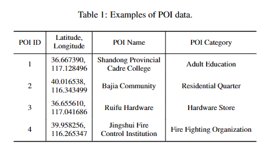

# poi-datasets
This the dataset of our work： 
  The POI data used in this work is collected from AMap. 
  After data pre-processing, the Haidian (HD) data contains 105,577 POIs associated with 248 categories, and the Lixia (LX) data contains 45,280 POIs associated with 140 categories.  
  We show the data example:
 

   

